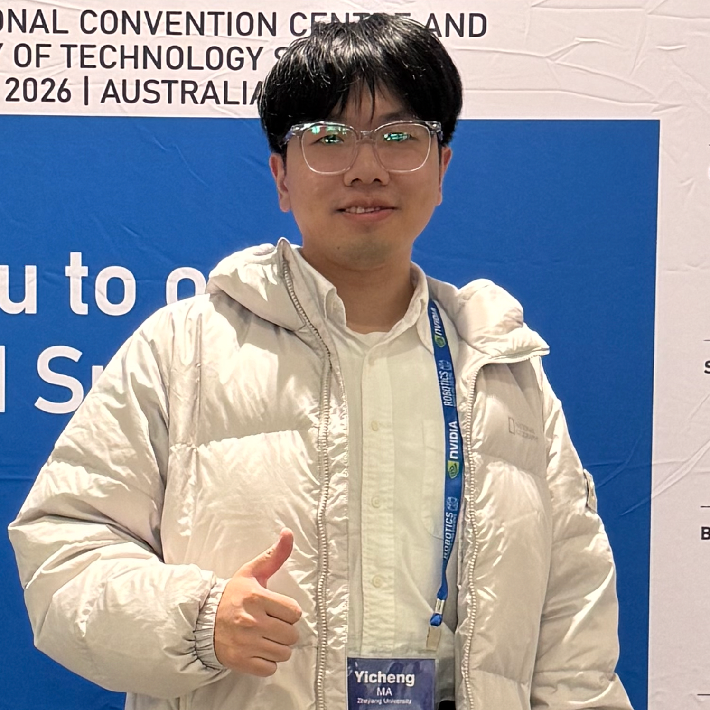
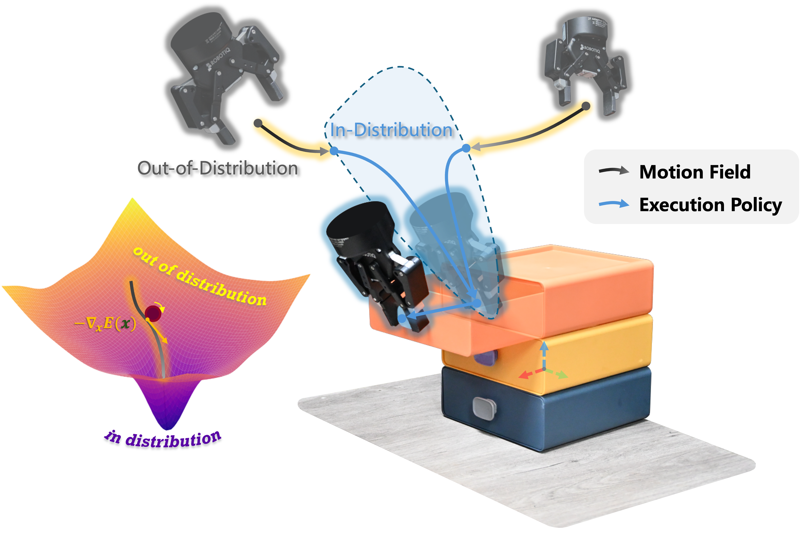
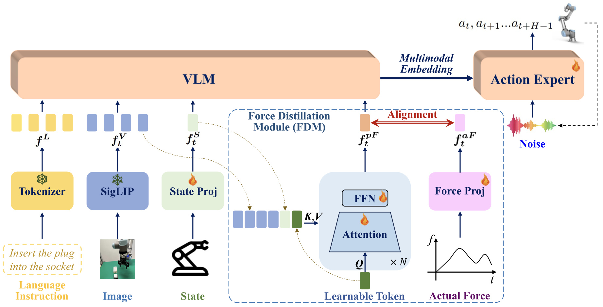
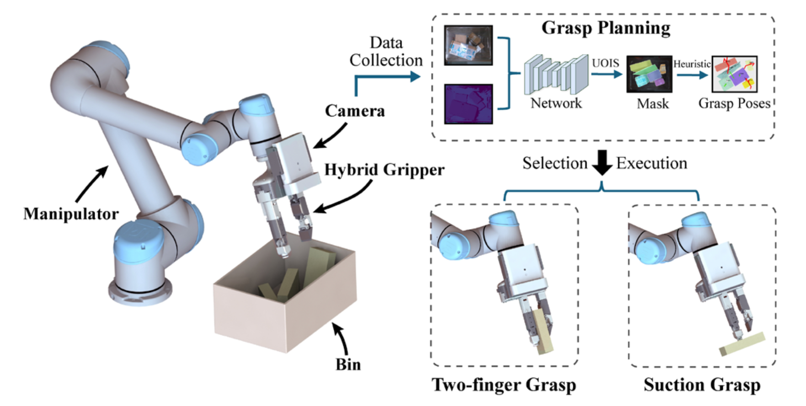
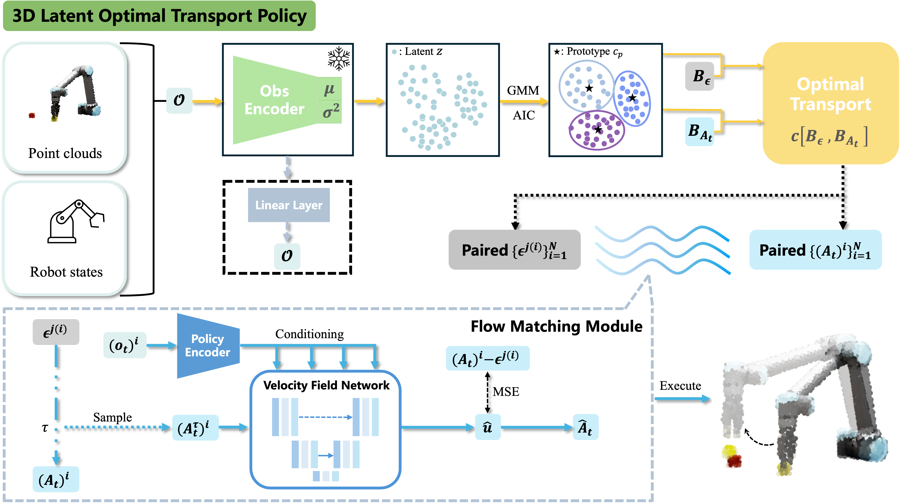
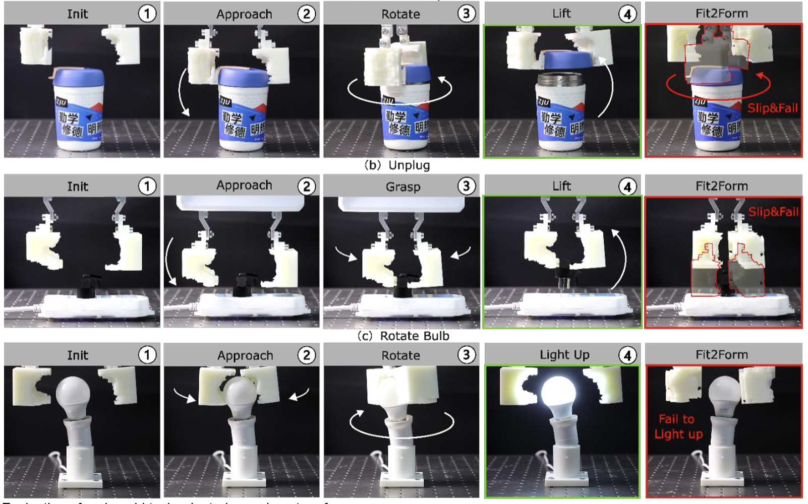
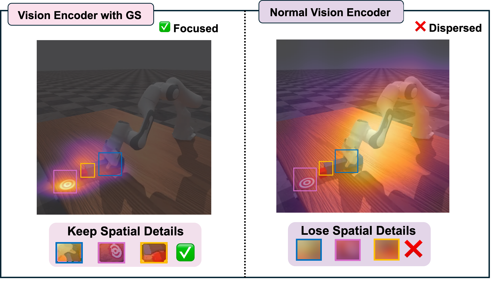

<nav id="top" class="home-nav" aria-label="Primary navigation">
  <a class="home-nav__brand" href="/" aria-label="Yicheng Ma — home">YM</a>
  

    <a class="home-nav__research" href="#research_interests">Research</a>
    <a href="#publications">Publications</a>
    <a href="#research_experience">Experience</a>
    <a class="home-nav__blog" href="/blog/">Blog</a>
    <a class="home-nav__contact" href="#contact">Contact &#8595;</a>
  

</nav>

<!-- ==================== PROFILE HEADER ==================== -->

  

    
    <!-- Open to PhD opportunities -->
  

  

    
Robot Learning &middot; Manipulation

    <h1>Yicheng Ma</h1>
    

      Research Assistant at <strong>Grasp Lab, Zhejiang University</strong>. 
      M.Sc. in Machine Learning at <strong>Nanyang Technological University</strong>. 
      <!-- Research Intern at <a href="https://www.a-star.edu.sg/simtech/research/adaptive-robotics-and-mechatronics-(arm)">A*STAR SIMTech ARM</a>, Singapore.  -->
      B.Eng. in Optoelectronic Information Engineering at <strong>Zhejiang University</strong>.
    

    

      Email: yichatma [at] gmail [dot] com
      <a href="https://github.com/yichatani" target="_blank" rel="noopener noreferrer"><i class="fab fa-github" aria-hidden="true"></i>GitHub&#8599;</a>
      <a href="#publications">Selected work&#8595;</a>
    

  

<!-- ==================== BIO ==================== -->

  I am currently a Research Assistant at the Grasp Lab, Zhejiang University. My research focuses on robot learning for dexterous manipulation, particularly generalizable and sample-efficient learning from limited demonstrations. I am interested in enabling robots to acquire complex manipulation skills and generalize them across objects, tasks, and environments.

<!-- My research focuses on robot learning for manipulation, with a particular interest in sample-efficient robot learning methods. Previously, I conducted research at the <a href="https://grasplab2022.github.io/">Grasp Lab</a> at Zhejiang University. I am currently exploring PhD opportunities in robot learning and manipulation and welcome inquiries via email. -->

<!-- ==================== RESEARCH INTERESTS ==================== -->
<section id="research_interests"></section>

<h2 class="section-heading">Research Interests</h2>

<!-- 

  Robot Learning
  Generalizable Robotic Manipulation
  Sample-Efficient Learning
  Visuomotor Policy Learning
  Contact-Rich Manipulation

 -->

  Robot Learning
  Dexterous Manipulation
  Generalizable Manipulation
  Sample-Efficient Learning

<!-- ==================== PUBLICATIONS ==================== -->
<section id="publications">

  <h2 class="section-heading">Publications</h2>

  

    (* equal contribution, &dagger; corresponding author)
  

  <!-- <h3 class="pub-subheading">Published / Accepted</h3> -->
  <h3 class="pub-subheading pub-subheading-accepted">Published / Accepted</h3>

  <!-- Pub: SID -->
  

    

      
    

    

      
SID: Sliding into Distribution for Robust Few-Demonstration Manipulation

      

        <strong>Yicheng Ma*</strong>, Wei Yu*, Zhian Su, Xidan Zhang, and Huixu Dong&dagger;
      

      

        Robotics: Science and Systems (RSS), 2026
        Oral Presentation
      

      

        <a class="pub-link-button" href="https://arxiv.org/abs/2605.13428" target="_blank" rel="noopener noreferrer">Paper</a>
        <a class="pub-link-button" href="https://sliding-into-distribution.github.io/" target="_blank" rel="noopener noreferrer">Webpage</a>
      

      <!-- 

        <a class="pub-link-button" href="https://sliding-into-distribution.github.io/" target="_blank" rel="noopener noreferrer">Webpage</a>
      
 -->
      

        
Abstract

        

          Generalizing robotic manipulation across object poses, viewpoints, and dynamic disturbances is difficult, especially with only a few demonstrations. End-to-end visuomotor policies are expressive but data-hungry, while planning and optimization satisfy explicit constraints but do not directly capture the interaction strategies demonstrated by humans. We propose Sliding into Distribution (SID), a structured framework that learns an object-centric motion field from canonicalized demonstrations to iteratively slide the system toward the demonstrated manifold and into the reliable operating region of a lightweight egocentric execution policy, mitigating out-of-distribution (OOD) execution. The motion field provides large corrective motions when far from the demonstration manifold and naturally vanishes near convergence, enabling robust reaching under substantial pose and viewpoint shifts. Within the reached regime, an egocentric policy trained with conditioned flow matching performs task-specific manipulation, supported by kinematically consistent point-cloud reprojection augmentation that preserves action–observation consistency. Across six real-world tasks, SID achieves approximately 90% success under OOD initializations with only two demonstrations, with under a 10% drop under distractors and external disturbances. Overall, SID provides a new paradigm for few-shot manipulation: explicitly managing distribution shift via online distribution recovery.
        

      

    

  

  <!-- Pub: FD-VLA -->
  

    

      
    

    

      
FD-VLA: Force-Distilled Vision-Language-Action Model for Contact-Rich Manipulation

      

        Ruiteng Zhao, Wenshuo Wang, <strong>Yicheng Ma</strong>, Xiaocong Li, Francis E.H. Tay, Marcelo H. Ang Jr. and Haiyue Zhu&dagger;
      

      

        International Conference on Robotics and Automation (ICRA), 2026
        <!-- Accepted -->
      

      

        <a class="pub-link-button" href="https://arxiv.org/abs/2602.02142" target="_blank" rel="noopener noreferrer">Paper</a>
      

      

        
Abstract

        

          Force sensing is a crucial modality for Vision-Language-Action (VLA) frameworks, as it enables fine-grained perception and dexterous manipulation in contact-rich tasks. We present Force-Distilled VLA (FD-VLA), a novel framework that integrates force awareness into contact-rich manipulation without relying on physical force sensors. The core of our approach is a Force Distillation Module (FDM), which distills force by mapping a learnable query token, conditioned on visual observations and robot states, into a predicted force token aligned with the latent representation of actual force signals. During inference, this distilled force token is injected into the pretrained VLM, enabling force-aware reasoning while preserving the integrity of its vision-language semantics. This design provides two key benefits: first, it allows practical deployment across a wide range of robots that lack expensive or fragile force-torque sensors, thereby reducing hardware cost and complexity; second, the FDM introduces an additional force-vision-state fusion prior to the VLM, which improves cross-modal alignment and enhances perception-action robustness in contact-rich scenarios. Surprisingly, our physical experiments show that the distilled force token outperforms direct sensor force measurements as well as other baselines, which highlights the effectiveness of this force-distilled VLA approach.
        

      

    

  

  <!-- Pub: Bin-picking -->
  

    

      
    

    

      
Construction of Bin-picking System for Logistic Application: A Hybrid Robotic Gripper and Vision-based Grasp Planning

      

        Zhian Su, <strong>Yicheng Ma</strong>, Haotian Guo, and Huixu Dong&dagger;
      

      

        IEEE Robotics and Automation Letters (RA-L), 2025
        <!-- Accepted -->
      

      

        <a class="pub-link-button" href="https://ieeexplore.ieee.org/document/11063337" target="_blank" rel="noopener noreferrer">Paper</a>
      

      

        
Abstract

        

          An autonomous bin-picking system for grasping various cluttered packages can significantly benefit logistics by reducing manual labor and streamlining processing. We propose a bin-picking system that includes a novel multi-mode hybrid gripper combining suction and pinch, and a corresponding vision-based grasp planning strategy based on unseen object instance segmentation. The system was evaluated in simulation achieving a 71.4% success rate, compared to suction (53.9%) and Hand-E (39.3%). Real-world experiments further validated its practicality in logistics scenarios.
        

      

    

  

  <!-- Pub: 3D-LOT -->
  

    

      
    

    

      
3D-LOT Policy: Latent Optimal Transport Flow Matching for One-Step Action Generation

      

        <!-- <strong>Yicheng Ma*</strong>, Mohan Liu*, Chang Su, Ruiteng Zhao, Zhiping Lin, and Haiyue Zhu&dagger; -->
        <strong>Yicheng Ma</strong>
      

      

        NTU Master's Dissertation
        <!-- Under Review -->
      

      

        <a class="pub-link-button" href="https://dr.ntu.edu.sg/entities/publication/15700b4e-2de9-468b-bc27-2f076f0fa025" target="_blank" rel="noopener noreferrer">Paper</a>
      

      

        
Abstract

        

          Real-time efficiency is critical for visuomotor policy learning, as any delay in action generation can accumulate over sequential control steps. In this work, we introduce 3D-LOT Policy, a latent prototype-guided optimal transport flow-matching framework for effective single-step action generation. Our approach encodes 3D observations into a compact latent space that preserves task-relevant spatial information and induces prototype structures to serve as anchors for policy learning. Our experiments demonstrate that 3D-LOT achieves lower latency while maintaining or even surpassing baseline performance, offering a practical solution for fast and robust visuomotor policy learning.
        

      

    

  

  <h3 class="pub-subheading pub-subheading-review">Manuscripts Under Review</h3>

  <!-- Pub: ForceForm -->
  

    

      
    

    

      
ForceForm: Robotic Gripper Generation via Differentiable Force Closure Optimization

      

        Haoran Huang, Ziyi Zheng, <strong>Yicheng Ma</strong>, Zhaohui Lin,  I-Ming Chen, and Huixu Dong&dagger;
      

      

        <!-- IEEE/ASME Transactions on Mechatronics -->
        <!-- Under Review -->
      

      

        
Abstract

        

          Reliable manipulation in industrial settings critically depends on the geometric structure of task-specific robotic grippers. However, conventional manual design is prohibitively expensive and relies heavily on human experience, while current automated methods often lack strict physical constraints, leading to unreliable grasping. To address these challenges, we propose ForceForm, the first framework to leverage differentiable force-closure optimization for adaptive gripper geometry generation, enabling the systematic synthesis of highly stable designs. First, both objects and grippers are represented using truncated signed distance functions (TSDF) to enable fully differentiable contact kinematics. Second, we devise a composite energy function via a differentiable quadratic program. This representation unifies and generalizes both normal and shear (friction) stresses, allowing the direct optimization of robust wrench-space force closure. Third, to navigate the non-convex design landscape, MALA++, an enhanced Metropolis-Adjusted Langevin Algorithm, is introduced to successfully escape local minima and promote topological diversity. Extensive experiments demonstrate that our pipeline achieves 91.6% grasp success, 84.8% stability, and 84.9% robustness across thousands of object instances, outperforming the state-of-the-art Fit2Form baseline by 6.1%, 9.0%, and 11.2%, respectively. By bridging physically grounded modeling with generative AI, ForceForm provides promising pathways for future scalable and reliable gripper design.
        

      

    

  

  <!-- Pub: Gaussian Spotlight -->
  

    

      
    

    

      
Gaussian Spotlight: Enhancing Visuomotor Policy Learning via Latent Spatial Keypoint Embedding

      

        Mohan Liu*, <strong>Yicheng Ma*</strong>, Chang Su, Zhiyuan Yang, Shijun Yan, Pey Yuen Tao, and Haiyue Zhu&dagger;
      

      <!-- 

        IEEE Robotics and Automation Letters (RA-L)
        Under Review
      
 -->
      

        
Abstract

        

          Generative visuomotor policies rely heavily on the conditioning representation to guide the synthesis of accurate and stable control sequences. Yet, standard visual encoders produce high-dimensional embeddings that often lose fine-grained spatial information while retaining substantial redundancy. To address this bottleneck, we propose Gaussian Spotlight, designed to construct a latent spatial keypoint embedding that serves as a more precise and manipulation-aware conditioning signal. Gaussian Spotlight first generates a state-conditioned anisotropic Gaussian Attention Field that selectively amplifies spatial regions critical for interaction. It then transforms these enhanced regions into implicit, latent keypoint embeddings via an attention-guided skip-layer aggregation pathway. Extensive experiments across diverse real-world manipulation tasks and simulation benchmarks demonstrate that Gaussian Spotlight consistently enhances policy performance.
        

      

    

  

  
</section>

<!-- ==================== RESEARCH EXPERIENCE ==================== -->
<section id="research_experience"></section>

<h2 class="section-heading">Research Experience</h2>

<!-- ---- Grasp Lab ---- -->

  

    Grasp Lab, Zhejiang University
    &mdash; Research Assistant
    Oct. 2025 &ndash; Present
  

<!-- ---- A*STAR ---- -->
<!-- 
 -->

  

    A*STAR SIMTech ARM, Singapore
    &mdash; Research Intern
    Sep. 2024 &ndash; Dec. 2025
  

<footer class="home-footer">
  &copy; {{ site.time | date: '%Y' }} Yicheng Ma
  <a href="#top">Back to top &#8593;</a>
</footer>
